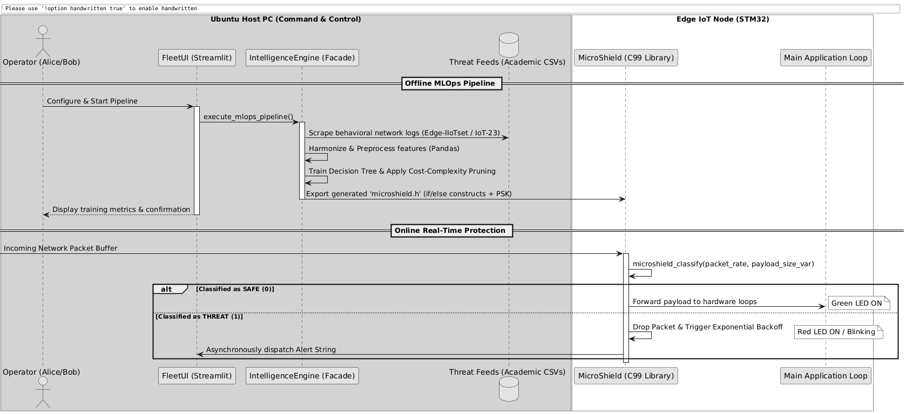

# 1. Project Concept

## 1.1 Product Architecture and Taxonomy
The **EdgeIntrusionDetector** is a distributed, hybrid security framework designed to safeguard resource-constrained Internet of Things (IoT) and Industrial IoT (IIoT) edge devices from network-based exploits. Architecturally, the system is classified as a **Data Processing Toolkit and Management Dashboard combined with an Embedded Middleware Library**. 

The product consists of two distinct software artifacts:
1. **Central Intelligence Dashboard (Python):** Acting as the Command and Control center, this tier orchestrates the data ingestion, feature engineering, and MLOps lifecycle using Pandas, Scikit-Learn, and Streamlit.
2. **MicroShield Library (ISO C99):** A lightweight, deterministic interceptor engine flashed onto the physical microcontroller (e.g., STM32 F407RE) that performs sub-millisecond threat classification directly within the low-level communication stack.

## 1.2 Use Case Collection & Operational Scenario
The operational domain targets high-availability industrial networks, environmental monitoring stations, or robotic fleets where edge nodes process real-time physical loops (e.g., actuators, sensor logging) and cannot tolerate the latency or availability risks of cloud-based security inspection.

* **System Actors and Roles:**
    * **Alice (Fleet Manager):** Interacts weekly or daily with the high-level Python Web UI using standard terminal desktops or web browsers. Her goal is to monitor network health logs, view real-time intrusion telemetry, and authorize over-the-air cryptographic updates.
    * **Bob (Security Analyst):** Interacts with the data orchestration backend to configure trusted public threat intelligence repositories, analyze confusion matrices of newly trained behavioral models, and tune pruning parameters.
* **Data Storage and Footprint:**
    * Heterogeneous, raw historical security dataset records are stored locally on the Host PC as structured CSV files.
    * No relational databases or high-overhead filesystems are deployed on the Edge Node. The node only stores transient network packet data in static RAM buffers and hardcoded model parameters within non-volatile flash memory (ROM).

## 1.3 Theoretical Background & Behavioral Paradigms
Traditional network defense mechanisms rely extensively on network identifiers such as static IP blacklists or rigid signature matching. In modern adversarial environments, this paradigm is fundamentally flawed: malicious actors routinely perform IP spoofing, and legitimately trusted internal nodes can be fully compromised (e.g., a localized exploit on an environmental sensor), turning them into trusted sources of malicious payloads.

To build a scientifically rigorous defense framework, this project discards static identifiers and adopts an **Anomaly-Based Behavioral Recognition Strategy**, derived from established academic literature:
* **Feature Selection Strategy:** Based on the empirical evaluations presented in the *Edge-IIoTset* and *IoT-23* foundational research papers, network streams are characterized by statistical features aggregated over explicit temporal windows rather than individual raw packet inspection. The primary metrics ingested by our system include:
    * `packet_rate`: The aggregate number of frames received per second, serving as the baseline detector for flooding anomalies and Denial of Service (DoS) conditions.
    * `payload_size_avg` and `payload_size_var`: The statistical mean and variance of the frame data length. Standard IoT telemetry is highly deterministic, resulting in a payload variance close to zero. Attacks (such as arbitrary code execution or buffer injections) heavily disrupt this regularity, causing a measurable spike in variance.
* **Algorithmic Selection (Decision Tree Classifier):** While Deep Learning architectures (such as Convolutional Neural Networks) show excellent performance in data science labs, they are entirely unsuited for resource-constrained embedded systems due to their non-deterministic execution times, floating-point overhead, and large memory footprint. Our design explicitly leverages a **Cost-Complexity Pruned Decision Tree**. By bounding the depth of the tree, the trained model can be natively compiled into basic nested conditional structures (`if/else` statements) in C. This guarantees a deterministic, sub-millisecond inference time capable of execution inside hardware Interrupt Service Routines (ISRs), directly fulfilling strict memory and latency constraints.

## 1.4 General System Flow
The overall lifecyle of the system is split into an offline automated MLOps pipeline on the host machine and an online real-time intrusion interception loop on the microcontroller node.

