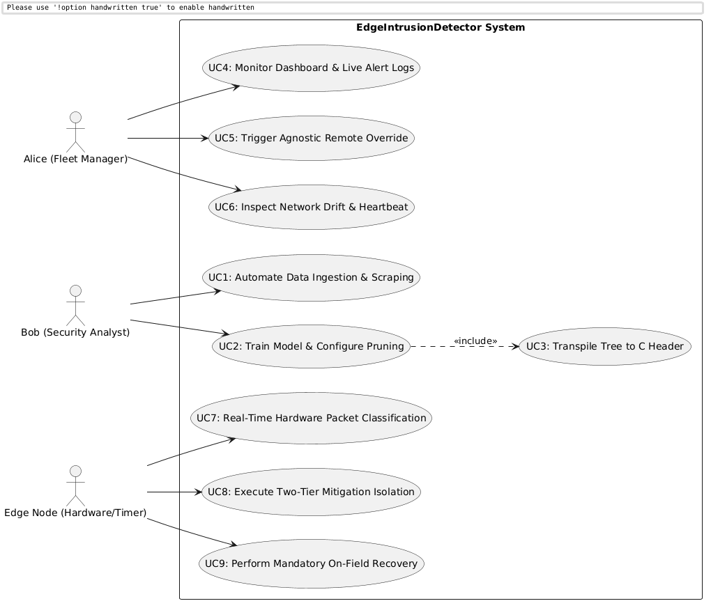
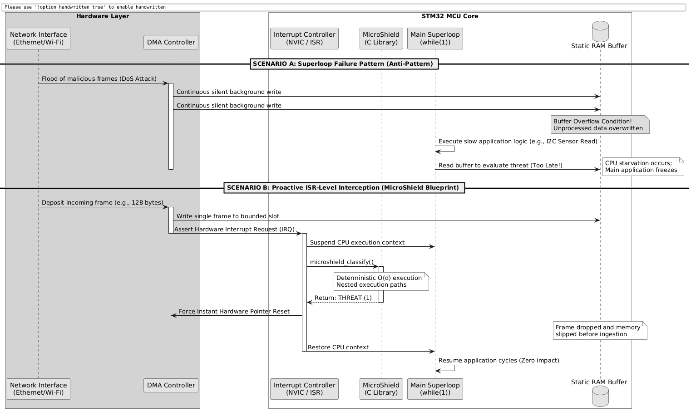

# 2. System Requirements

This section formalizes the user stories, functional requirements, non-functional requirements, implementation constraints, and explicit acceptance criteria for the **EdgeIntrusionDetector** framework.

## 2.1 User Stories & Personas

### Persona: Bob (Security Analyst)
*   **User Story 1:** As a Security Analyst, I want the system to automatically ingest referenced academic datasets (Edge-IIoTset/IoT-23) so that I do not have to manually scrape threat feeds before training a model.
*   **User Story 2:** As a Security Analyst, I want to tune and prune a Decision Tree model via a dashboard so that I can control its complexity and fit the resulting rules into constrained memory profiles.
*   **User Story 3:** As a Security Analyst, I want the system to automatically transpile the trained model into a native C header file so that I can integrate it into embedded projects without manual coding.

### Persona: Alice (Fleet Manager)
*   **User Story 4:** As a Fleet Manager, I want a unified Streamlit dashboard to monitor the live operational status and real-time security alerts sent by the edge nodes.
*   **User Story 5:** As a Fleet Manager, I want to clear a soft isolation lock from the dashboard via a remote command if I detect a false positive anomaly.
*   **User Story 6:** As a Fleet Manager, I want the base station to agnostically flag a node if its heartbeat or packet frequency breaks historical patterns, preventing silent false negatives.

---

## 2.2 Requirements Analysis

### 2.2.1 Functional Requirements (FR)

#### F-1: Automated Threat Data Ingestion
*   **Description:** The `BaseStation` must autonomously ingest, parse, and clean referenced historical threat CSV logs from local or remote repositories.
*   **Acceptance Criteria (AC-1):** The data ingestion script must parse a raw 100MB CSV file, handle null values, and output a clean, partitioned dataset into the workspace within 30 seconds.

#### F-2: MLOps Configuration & Decision Tree Pruning
*   **Description:** The system must orchestrate a Machine Learning pipeline to train a *Decision Tree Classifier*, exposing Cost-Complexity Pruning parameters via the UI.
*   **Acceptance Criteria (AC-2):** Changing the pruning alpha slider on the UI must successfully cap the maximum depth of the trained tree to the user-defined limit.

#### F-3: Automatic C Transpilation
*   **Description:** The backend must parse the active Python Decision Tree object and transpile its logic into automated nested `if/else` native C structures, outputting a standalone `microshield.h` file.
*   **Acceptance Criteria (AC-3):** The exported `microshield.h` must compile under standard GCC compilers without warnings and accurately replicate the classification outputs of the Python model.

#### F-4: Central Interactive Monitoring Dashboard
*   **Description:** The system must serve a **Streamlit** dashboard showing model validation metrics (Accuracy, Confusion Matrix) and live telemetry logs.
*   **Acceptance Criteria (AC-4):** When a simulation alert is received, the dashboard log table must update asynchronously within 2 seconds.

#### F-5: Agnostic False Negative Supervision (Network Drift)
*   **Description:** The `BaseStation` must track an agnostic *Heartbeat* window and flag a node if its statistical transmission rate deviates drastically from its historical baseline.
*   **Acceptance Criteria (AC-5):** If an active edge node stops sending its heartbeat frame for greater than 3 periods, an explicit critical alarm status must trigger on the Streamlit dashboard.

#### F-6: Proactive ISR/DMA Interception
*   **Description:** The `MicroShield` C library must inspect incoming network buffers within the hardware Interrupt Service Routine (ISR) or DMA callbacks, instantly dropping malicious packets.
*   **Acceptance Criteria (AC-6):** Packets marked as a `THREAT` must be dropped at the hardware register layer by resetting buffer pointers before the main software loop ingests the frame data.

#### F-7: Two-Tier Progressional Isolation
*   **Description:** The `EdgeNode` must enforce a tiered mitigation: *Tier 1 (Soft Isolation)* triggers an exponential backoff while keeping the service channel open; *Tier 2 (Hard Isolation)* shuts down all logical communication channels.
*   **Acceptance Criteria (AC-7):** Persistent attack frames over a 30-second window must force the node to transition automatically from Tier 1 into a complete Tier 2 lockdown.

#### F-8: Remote Soft-State Remediation
*   **Description:** An operator must be able to dispatch a signed `OverrideCommand` from the dashboard to restore a node stuck in Tier 1 isolation.
*   **Acceptance Criteria (AC-8):** Sending the remote override signal must reset the internal edge backoff timers and restore nominal green LED status within 5 seconds.

#### F-9: Mandatory On-Field Hardware Recovery
*   **Description:** A node locked in Tier 2 isolation must refuse all remote connections. Recovery must require a physical hardware button press.
*   **Acceptance Criteria (AC-9):** While in Tier 2, the node must drop 100% of remote network commands. Normal execution must only resume after asserting the physical *User Button* on the target MCU.

---

### 2.2.2 Non-Functional Requirements (NFR)

#### NF-1: Deterministic Latency Bounds (Efficiency)
*   **Description:** The evaluation time of the `MicroShield` library must be strictly deterministic with a time complexity of $O(d)$, where $d$ is the tree depth.
*   **Acceptance Criteria (AC-NF1):** The total inference execution time within the ISR loop must stay strictly under 1 millisecond under continuous hardware emulation.

#### NF-2: Static Memory Footprint (Safety)
*   **Description:** The `MicroShield` library is strictly prohibited from using dynamic allocation routines (`malloc`/`calloc`).
*   **Acceptance Criteria (AC-NF2):** Compilation maps must prove that 100% of the classification memory footprint is allocated statically inside Flash (ROM) and static RAM at build time.

---

### 2.2.3 Implementation Requirements (IR)
These constraints are enforced by explicit academic and evaluation mandates specified by the examination board.

*   **IR-1 (Workspace Isolation):** The `BaseStation` environment must be fully managed via **Poetry** with a python dependency constraint of `>=3.10` to guarantee cross-platform evaluation reproducibility for the evaluators.
*   **IR-2 (Embedded Target IDE):** The edge code must compile as an ISO C library compatible with the **STMicroelectronics STM32CubeIDE** platform to align with laboratory hardware validation standards.
*   **IR-3 (Performance Microbenchmarking):** The validation phase must include a cycle-accurate hardware benchmark using the MCU's internal **DWT (Data Watchpoint and Trace)** registers to explicitly measure system execution clock cycles with and without the security layer active.

---

## 2.3 System Use Case Mapping
The following diagram details the explicit interactions between human operators, system background timers, and the core operational use cases of the architecture.

## 2.4 Architectural Trade-Off Analysis
The following diagram details why an ISR-level classification model is mandatory compared to traditional Superloop models when subjected to malicious network packet saturation.

