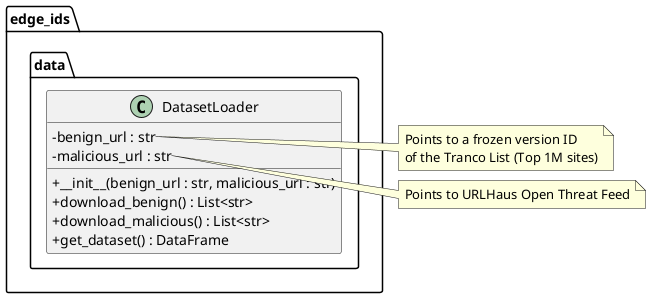

# Design

This chapter explains the strategies used to meet the requirements identified in the analysis. 

Ideally, the design should be the same, regardless of the technological choices made during the implementation phase.

> You can re-order the sections as you prefer, but all the sections must be present in the end

## Architecture 

The system adopts a **Layered Architecture** style combined with a **Pipeline** pattern for the data processing stages. This choice is motivated by the need to strictly separate the data acquisition logic (which depends on external unstable sources) from the core machine learning logic (which requires stable input) and the deployment logic (embedded constraints).

The architecture consists of three main layers:
1.  **Data Acquisition Layer**: Responsible for retrieving raw threat intelligence data from external sources and harmonizing it into a standard format.
2.  **Modelling Layer**: Responsible for training the Neural Network and exporting the optimized model.
3.  **Edge Deployment Layer**: The target embedded environment (STM32) where the inference takes place.

This separation allows for independent testing of the scraper and the neural network.

> UML Components diagrams are welcome here

## Infrastructure (mostly applies to distributed systems)

- Are there **infrastructural components** that need to be introduced? Which and **how many** of each?
    - e.g. **clients**, **servers**, **load balancers**, **caches**, **databases**, **message brokers**, **queues**, **workers**, **proxies**, **firewalls**, **CDNs**, etc.
- How do components **distribute** over the network? **Where** are they located?
    - e.g. do servers / brokers / databases / etc. sit on the same machine? on the same network? on the same datacenter? on the same continent?
- How do components **find** each other?
    - How to **name** components?
    - e.g. **DNS**, **service discovery**, **load balancing**, etc.

> UML deployment diagrams are welcome here

## Modelling

### Domain driven design (DDD) modelling

- Which are the bounded contexts of your domain? 
- Which are domain concepts (entities, value objects, aggregates, etc.) for each context?
- Are there repositories, services, or factories for each/any domain concept?
- What are the relavant domain events in each context?

> Context map diagrams are welcome here

### Object-oriented modelling

The class is designed to accept URLs via Dependency Injection in the constructor (`__init__`), ensuring that the component is testable and not hard-coded to specific external servers.

### Design Decisions

    * **Encapsulation**: The logic for connecting to external HTTP servers is encapsulated within the `DatasetLoader`. The rest of the software does not need to know about `requests` or CSV parsing.
    * **Configurability**: URLs are passed as arguments to the constructor (`__init__`), allowing dependency injection.

### In case of a distributed system

- How do the domain concepts map to the architectural or infrastuctural components?
    + i.e. which architectural/component is responsible for which domain concept?
    + are there data types which are required onto multiple components? (e.g. messages being exchanged between components)

- What are the domain concepts or data types which represent the state of the distributed system?
    + e.g. state of a video game on central server, while inputs/representations on clients
    + e.g. where to store messages in an instant-messaging app? for how long?

- Are there domain concepts or data types which represent messages being exchanged between components?
    + e.g. messages between clients and servers, messages between servers, messages between clients

## Interaction

- How do components *communicate*? *When*? *What*?

- Which **interaction patterns** do they enact?

> UML sequence diagrams are welcome here

## Behaviour

- How does **each** component *behave* individually (e.g., in *response* to *events* or messages)?
    + Some components may be *stateful*, others *stateless*

- Which components are in charge of updating the **state** of the system? *When*? *How*?

> UML state diagrams or activity diagrams are welcome here

## Data-related aspects (in case persistent storage is needed)

- Is there any data that needs to be stored?
    - *What* data? *Where*? *Why*?

- How should **persistent data** be **stored**? Why?
    - e.g., relations, documents, key-value, graph, etc.

- Which components perform queries on the database?
    - *When*? *Which* queries? *Why*?
    - Concurrent read? Concurrent write? Why?

- Is there any data that needs to be shared between components?
    - *Why*? *What* data?

