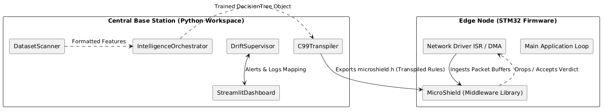
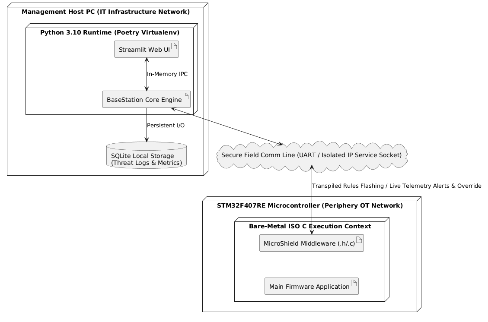
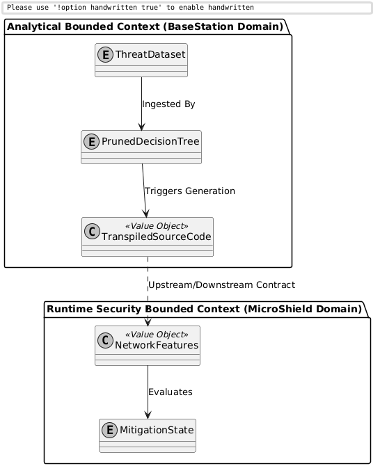
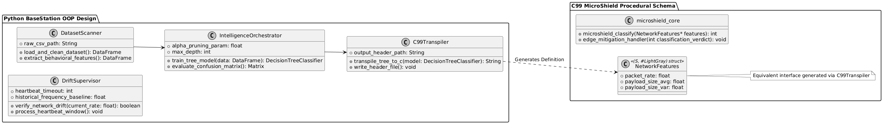

# 3A. Structural Design

This section delineates the structural blueprints devised to fulfill the security specifications of the **Edge Intrusion Detector** ecosystem. In compliance with academic software engineering methodologies, this structural layout detaches abstract architectural responsibilities from concrete implementation frameworks, establishing a clear hierarchy from high-level subsystems down to low-level procedural layouts.

---

## 3A.1 System Architecture

The global topology of the framework leverages a **Component-Based Architectural Style** synchronized with a strict **Hub-and-Spoke (Star) Network Topology**. Alternate architectural configurations have been explicitly evaluated and rejected due to resource constraints:
*   *Event-Driven / Broker-Centric Architectures (e.g., MQTT/Kafka):* Rejected due to the severe RAM and flash memory footprints required to maintain a message broker client engine inside a bare-metal microcontroller, which fundamentally threatens real-time execution safety.
*   *Shared Dataspace Architectures:* Rejected because edge hardware nodes operate in completely isolated memory environments and cannot access centralized relational database engines without inducing catastrophic network latencies.

The architecture is subdivided into two primary co-dependent macro-components operating in an asymmetric client-server relationship:
1.  **Central Base Station Subsystem:** Orchestrates the high-overhead analytical lifecycles, data processing, model translation, and human operator UI interfaces.
2.  **Edge Node Subsystem:** Acts as a lightweight, autonomous perimeter interceptor that executes deterministic security validation directly within low-level hardware routines.

### 3A.1.1 Structural Component Mapping
The following diagram highlights the modular decomposition and the internal dependencies linking the core modules of the system.

#### Architectural Component Responsibilities
*   `DatasetScanner`: Responsible for local/remote threat data ingestion, data cleaning, and data framing (FR-1).
*   `IntelligenceOrchestrator`: Responsible for parsing algorithmic metadata, enforcing cost-complexity boundaries, and compiling optimized decision trees (FR-2).
*   `C99Transpiler`: Acts as the bridge between domains, converting python objects into native C code (FR-3).
*   `DriftSupervisor`: Implements long-term historical log scanning to catch false negatives via packet frequency drift (FR-5).
*   `MicroShield Middleware`: Executes within the edge node to process packet buffers and output sub-millisecond evaluation verdicts (FR-6).

---

## 3A.2 System Infrastructure & Distribution

The system components are physically decoupled across distinct infrastructure layers to protect operational availability. The following deployment blueprint details how components are distributed across network domains.

### 3A.2.1 Component Distribution & Naming Conventions
*   **Infrastructure Segregation:** The `Central Base Station` operates inside the secure Enterprise IT local network infrastructure. The `Edge Nodes` sit directly on the plant field or operational perimeter within the Operational Technology (OT) domain.
*   **Physical Location Boundaries:** The IT server core runs within standard x86 Unix host platforms. The OT components run inside physical ARM Cortex-M microcontrollers (STM32) without operating systems (Bare-Metal).
*   **Service Discovery and Component Naming:** To eliminate DNS overhead and vulnerability vectors (such as DNS spoofing or registration latency), the framework implements an immutable **Static Component Identification Naming Strategy**. Each physical edge device has an immutable `NODE_ID` compiled directly into its static memory. The `Central Base Station` maintains a hardcoded network lookup dictionary mapping unique hardware tokens to dedicated communication lines, removing service discovery runtime overhead.

---

## 3A.3 System Modelling

To strictly enforce a cohesive language across the analytical and physical runtime domains, modeling descends from strategic Domain-Driven Design boundaries down to fine-grained Object-Oriented layouts and procedural structures.

### 3A.3.1 Domain-Driven Design (DDD) Context Mapping
The domain space is cleaved into two isolated *Bounded Contexts*, establishing a formal upstream-downstream relationship where the analytical domain acts as the upstream provider.

*   **Analytical Bounded Context:** Encapsulates high-level entities such as training datasets, evaluation metrics, and the model pruning engine. It operates under loose temporal constraints.
*   **Runtime Security Bounded Context:** Enforces high-efficiency structures operating under strict real-time constraints. It treats transpiled code arrays as deterministic value objects that guide mitigation behaviors.

### 3A.3.2 Object-Oriented & Procedural Data Type Modeling
The `Central Base Station` is engineered utilizing an Object-Oriented paradigm to prioritize modular extension and maintainability. Conversely, the `MicroShield` core is modeled via an optimized procedural layout to achieve deterministic performance on bare-metal hardware.

The diagram below details the attributes, internal methods, and structural relationships of the unified system.

#### Model Specifications
*   `DatasetScanner`: Encapsulates file paths and handles the sanitization of historical inputs, isolating pandas DataFrame representations from the rest of the workspace.
*   `IntelligenceOrchestrator`: Houses the model configuration hyperparameters (alpha pruning constraints, max depth bounds). It encapsulates scikit-learn tree operations to preserve architectural independence.
*   `C99Transpiler`: A specialized utility class that scans the internal structural node arrays (`tree_.feature`, `tree_.threshold`) of a trained model. It recursively translates bivalve decisions into a clean C string layout and serializes it to disk.
*   `NetworkFeatures`: A localized, statically packed C structure that holds the running calculations for `packet_rate`, `payload_size_avg`, and `payload_size_var`. This block ensures a zero-allocation footprint inside the critical hardware execution loops.

