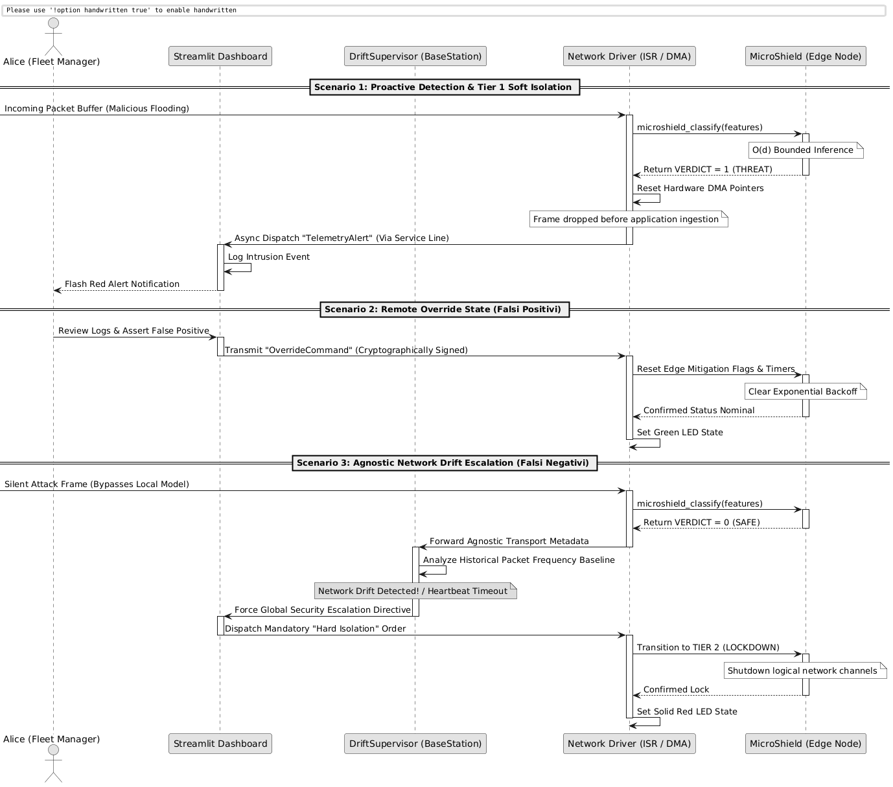
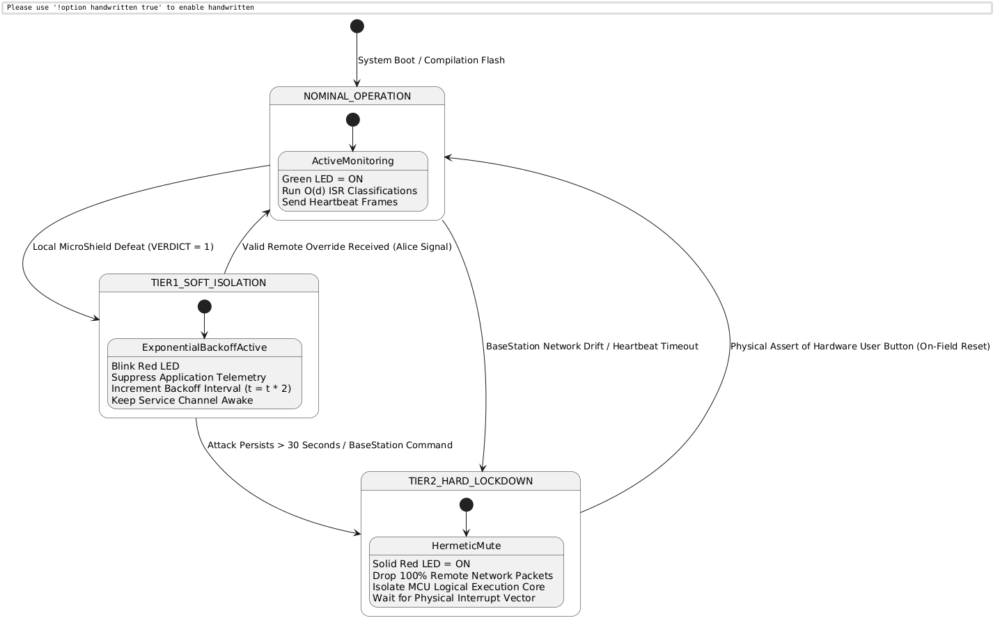

# 3B. Behavioral Design

This section formalizes the dynamic behaviors, communication protocols, and runtime state state-machines implemented to govern the interactions between the **Central Base Station** and the **Edge Nodes**[cite: 1]. 

---

## 3B.1 System Interaction & Protocols

The distributed nodes enact structured, asymmetric synchronization patterns to communicate over the network topology without degrading the real-time response constraints of the physical peripheral[cite: 1]. 

The system maps communication lifecycles into three explicit operational scenarios detailed in the following sequence schema[cite: 1].

### 3B.1.1 Interaction Scenarios Description
*   **Proactive Detection (Scenario 1):** Triggered when a flooding attack hits the network interface. The evaluation occurs entirely within the local `MicroShield` ISR space. The buffer allocation pointer is reset on the hardware register layer instantly, dropping the thread before it contaminates application RAM[cite: 1]. An asynchronous `TelemetryAlert` is dispatched over the service line to inform *Alice*[cite: 1].
*   **Remote Remediation (Scenario 2):** Solves the False Positive problem. If an anomaly is identified as legitimate application traffic by *Alice*, a cryptographically signed `OverrideCommand` is transmitted downstream via the dedicated service channel. The network interface intercepts this instruction, clears the local mitigation flags, and restores nominal execution[cite: 1].
*   **Agnostic Supervision (Scenario 3):** Solves the False Negative problem. If a silent malicious vector evades local intelligence, the `BaseStation` evaluates the historical packet transport metadata[cite: 1]. Upon detecting a mathematical *Network Drift* or an explicit *Heartbeat Timeout*, the supervisor system downgrades the target edge node remotely, bypassing its local configuration and forcing a lockdown[cite: 1].

---

## 3B.2 Component Behavioural Modeling

The lifecycle of an active `EdgeNode` is modeled via a formal **Finite State Machine (FSM)** designed to prioritize safety, fail-secure containment, and strict mitigation escalation[cite: 1].

### 3B.2.1 State Specifications
*   **NOMINAL_OPERATION:** The edge node functions under steady-state conditions. The on-board Green LED is active. The `MicroShield` engine evaluates network buffers inside ISR vectors with deterministic $O(d)$ latency, while standard application logic transmits heartbeat signals back to the base station[cite: 1].
*   **TIER1_SOFT_ISOLATION:** Activated immediately upon a local threat classification[cite: 1]. The node flags the anomaly by blinking the Red LED and halting standard application telemetry streams[cite: 1]. It initializes an *Exponential Backoff* mechanism, exponentially delaying network re-connection attempts to starve the attacker's vector[cite: 1]. The node keeps its secondary logical service reception channel open to accept remote override packets dispatched by *Alice*[cite: 1].
*   **TIER2_HARD_LOCKDOWN:** A terminal fail-secure state triggered by persistent attacks or explicit supervision directives[cite: 1]. The node activates a solid Red LED indicator and hermetically seals its communication layer, dropping 100% of remote incoming network traffic[cite: 1]. To prevent attackers from exploiting software overrides, the remote communication channels are physically unmapped[cite: 1]. The system stays locked until an operator physically pushes the microcontroller's hardware *User Button* on the plant floor, triggering an isolated hardware reset vector[cite: 1].

---

## 3B.3 Data Persistence & Management Strategies

In compliance with strict resource segregation mandates, the system decouples analytical state requirements from runtime operational environments[cite: 1].

### 3B.3.1 Central Base Station Storage Architecture
The `Central Base Station` acts as the single source of truth for persistent metrics and historical datasets[cite: 1].
*   **Raw Threat Records:** Large-scale historical behaviors (ingested from CSV source feeds) are kept exclusively within the Host PC file-system, parsed streaming via *Pandas* chunking to restrict runtime RAM saturation.
*   **Operational Log Database:** A localized, relational **SQLite** database instance is embedded within the Python virtual environment. This engine stores incoming `TelemetryAlert` logs, validation matrices, and historical tracking states. The *Streamlit* dashboard queries this database concurrently to present real-time dashboards to *Alice* and *Bob*[cite: 1].

### 3B.3.2 Edge Node Memory Mapping (Zero-Persistence Policy)
To enforce compliance with hardware safety constraints and prevent storage latency bottlenecks, the `EdgeNode` applies a strict **Zero-Persistence Policy**[cite: 1].
*   **No File Systems:** The microcontroller maintains no relational databases, flash filesystems, or non-volatile allocation tables[cite: 1].
*   **ROM Allocation:** The transpiled conditional decision branches (`microshield.h`) are baked directly into the immutable **Flash Memory (ROM)** during compilation.
*   **RAM Allocation:** Active configuration states, running exponential backoff counters, and transient network feature buffers are mapped into static, volatile **SRAM** blocks[cite: 1]. In case of power loss or hard reset execution, the local volatile footprint is fully purged, preventing persistent exploit payloads from residing in memory.
